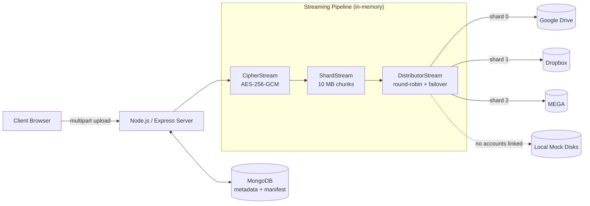
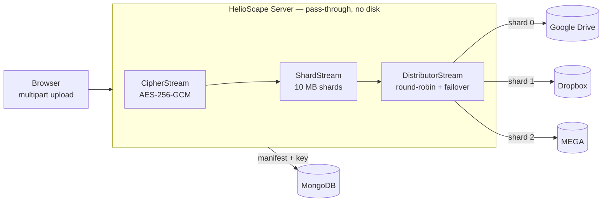
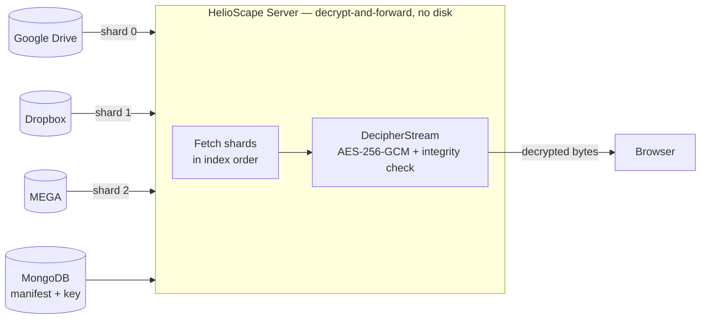

# HelioScape ☁️🛡️

> **Decentralized, encrypted "meta-cloud" storage aggregator.**
> Combine the free storage tiers of Google Drive, Dropbox, and MEGA into a single, encrypted virtual drive — where no single provider ever holds a complete, readable copy of your file.

---

## Table of Contents

- [What is HelioScape?](#what-is-helioscape)
- [How it works (60-second version)](#how-it-works-60-second-version)
- [Feature Highlights](#feature-highlights)
- [Upload & Download Flows](#upload--download-flows)
- [Tech Stack](#tech-stack)
- [Quick Start](#quick-start)
- [Configuration](#configuration)
- [Usage Examples](#usage-examples)
- [Project Structure](#project-structure)
- [Documentation](#documentation)
- [FAQ](#faq)
- [Security Notice](#security-notice-read-this)

---

## What is HelioScape?

Every free cloud plan is a small island of storage — 15 GB here, 2 GB there, 20 GB somewhere else. HelioScape stitches those islands together.

When you upload a file, HelioScape:

1. **Encrypts** it on the server with AES-256-GCM (a unique key per file).
2. **Splits** the encrypted stream into fixed-size **10 MB shards**.
3. **Distributes** those shards across your linked cloud accounts using round-robin.
4. **Records** a manifest in MongoDB describing which shard lives on which provider.

Because each provider only ever receives *encrypted fragments* of your data, no single provider can reconstruct — let alone read — your file. To get the file back, HelioScape reads the manifest, pulls every shard from its provider, reassembles them in order, and decrypts the stream back to you.

The whole pipeline is **stream-based**: files flow through the server in ~10 MB windows and are never buffered whole to disk, so a multi-gigabyte upload uses only a small, constant amount of RAM.

---

## How it works (60-second version)



> A file's **encryption key** and its **shard manifest** are both stored in MongoDB. See the [Security Notice](#security-notice-read-this) for what that means for the "zero-knowledge" claim.

For the full picture, read [docs/ARCHITECTURE.md](docs/ARCHITECTURE.md), [docs/UPLOAD-FLOW.md](docs/UPLOAD-FLOW.md), and [docs/DOWNLOAD-FLOW.md](docs/DOWNLOAD-FLOW.md).

---

## Feature Highlights

| Area | What you get |
| :--- | :--- |
| **Storage aggregation** | Link multiple Google Drive, Dropbox, and MEGA accounts; use them as one pool. |
| **Client-transparent encryption** | Every file encrypted with AES-256-GCM before it leaves the server. |
| **Streaming sharding** | 10 MB shards, constant memory footprint, backpressure-aware distribution. |
| **Upload failover + rollback** | If one provider fails a shard, the distributor retries others; if all fail, it rolls back already-uploaded shards. |
| **Download failover** | Chunks can be recovered from any linked account of the same provider, not just the original one. |
| **Optional RAID-5 redundancy** | "High Redundancy" mode adds XOR parity so a file survives losing one shard per group. |
| **Folders & file management** | Nested folders, rename, move, search, media gallery. |
| **Accounts & authentication** | Email + password with OTP email verification, password reset, JWT sessions. |
| **Live visualizations** | Animated network topology and per-account / per-file distribution views. |
| **Interactive tour** | First-run guided walkthrough (driver.js). |
| **API docs** | Swagger UI served at `/api-docs`. |

---

## Upload & Download Flows

The most important thing to understand: **the HelioScape server is a pass-through relay, not a storage stage.** Your file is never written to the server's disk and is never held in memory as a whole — bytes stream *through* the server in ~10 MB windows. The browser only ever talks to the HelioScape server; it never contacts the cloud providers directly.

### 📤 Upload flow

Bytes are encrypted, split, and shipped to providers on the fly — by the time the last byte reaches the server, most of the file is already in the cloud.



1. **Encrypt** the stream (unique per-file AES-256-GCM key).
2. **Shard** the ciphertext into fixed 10 MB pieces.
3. **Distribute** shards round-robin across your linked accounts, retrying other providers on failure (and rolling back if all fail).
4. **Record** a manifest in MongoDB mapping every shard → its provider.

→ Full detail with sequence diagrams: [docs/UPLOAD-FLOW.md](docs/UPLOAD-FLOW.md)

### 📥 Download flow

The reverse: shards are pulled back, reassembled in order, and decrypted — streamed straight to the browser. The HTTP response opens **before any shard is fetched**, so download starts immediately.



1. **Look up** the file's manifest and decryption key.
2. **Fetch** each shard from its provider (failing over to your other accounts of the same provider if one is down).
3. **Reassemble** shards in order and **decrypt**; the GCM auth tag verifies integrity — tampered data fails loudly.
4. In **RAID-5 mode**, a single missing shard per group is rebuilt via XOR parity before decryption.

→ Full detail with sequence diagrams: [docs/DOWNLOAD-FLOW.md](docs/DOWNLOAD-FLOW.md)

> **Memory footprint:** standard transfers hold only ~1 shard (~10 MB) in flight; RAID-5 holds one group (~40–50 MB). Nothing touches the server's disk in either direction.

---

## Tech Stack

**Frontend**
- React 18 + Vite
- Tailwind CSS (custom cyan/violet/emerald "glass-panel" theme, CSS-variable driven) + Radix UI (shadcn/ui) primitives
- Zustand (global state, with an encrypted-localStorage auth store)
- TanStack React Query (server state / data fetching)
- React Router v6, driver.js (tour), lucide-react (icons)

**Backend**
- Node.js + Express
- Node native `stream` + `crypto` (the encryption/sharding engine)
- Busboy (multipart streaming parser)
- Mongoose / MongoDB
- `mongoose-field-encryption` (encrypts OAuth tokens & MEGA credentials at rest)
- Provider SDKs: `googleapis`, `dropbox`, `megajs`
- `jsonwebtoken`, `bcryptjs`, `helmet`, `nodemailer`, `swagger-jsdoc`

**Infrastructure**
- Docker + Docker Compose (server, client, MongoDB, Mongo Express)

---

## Quick Start

### Prerequisites

- **Docker Desktop** (required)
- **Node.js 18+** (optional — only for running the apps outside Docker)

### Automated setup (recommended)

The helper script checks Docker, generates secrets into `.env`, builds the containers, and enters Docker Compose *watch* mode (hot reload).

```bash
chmod +x setup.sh
./setup.sh
```

Then open:

| Service | URL |
| :--- | :--- |
| Frontend | http://localhost:5173 |
| Backend API | http://localhost:5000 |
| Swagger API docs | http://localhost:5000/api-docs |
| Mongo Express (DB admin) | http://localhost:8081 |

### Manual setup

```bash
# 1. Create a .env in the project root (see Configuration below)
# 2. Build and start everything
docker compose up -d --build

# 3. (Optional) hot-reload dev mode
docker compose watch
```

### Running without Docker

```bash
# Terminal 1 — backend
cd server
npm install
npm run dev        # nodemon on http://localhost:5000

# Terminal 2 — frontend
cd client
npm install
npm run dev        # Vite on http://localhost:5173
```

> Running outside Docker still needs a reachable MongoDB. Set `MONGO_URI` in the server environment (defaults to `mongodb://localhost:27017/helio`).

---

## Configuration

`setup.sh` auto-generates a root `.env` with database and JWT secrets. You must fill in cloud API keys manually to link real providers. **Without any linked accounts, HelioScape falls back to two local mock "disks"** (`server/storage_mock/disk1` and `disk2`), which is perfect for trying it out.

### Core variables

| Variable | Description | Default |
| :--- | :--- | :--- |
| `PROJECT_NAME` | Docker project prefix / volume naming | `helioscape` |
| `SERVER_PORT` | Express backend port | `5000` |
| `CLIENT_PORT` | Vite frontend port | `5173` |
| `VITE_API_URL` | API base URL the client calls | `http://localhost:5000/api` |
| `MONGO_USER` / `MONGO_PASS` | MongoDB root credentials | `admin` / auto-generated |
| `MONGO_URI` | Full Mongo connection string (set by compose) | — |
| `JWT_SECRET` | Secret for signing JWTs **and** encrypting stored tokens | auto-generated |
| `CLIENT_URL` | Allowed CORS origin & OAuth redirect target | `http://localhost:5173` |

### Cloud provider keys (optional)

```dotenv
# --- GOOGLE DRIVE (OAuth 2.0) ---
GOOGLE_CLIENT_ID=your_client_id
GOOGLE_CLIENT_SECRET=your_client_secret
GOOGLE_CALLBACK_URL=http://localhost:5000/api/oauth/google/callback

# --- DROPBOX (OAuth 2.0) ---
DROPBOX_CLIENT_ID=your_app_key
DROPBOX_CLIENT_SECRET=your_app_secret
DROPBOX_CALLBACK_URL=http://localhost:5000/api/oauth/dropbox/callback

# --- MEGA (direct credentials, no OAuth) ---
# Entered by the user in the app UI, not required in .env

# --- EMAIL / OTP (optional; falls back to console logging) ---
SMTP_HOST=
SMTP_PORT=587
SMTP_USER=
SMTP_PASS=
SMTP_FROM=
SMTP_SECURE=false
```

> **Step-by-step provider setup** (Google, Dropbox, MEGA) lives in [docs/PROVIDERS.md](docs/PROVIDERS.md).
>
> If `SMTP_HOST` is unset, OTP codes are printed to the **server logs** instead of emailed — convenient for local development.

---

## Usage Examples

### 1. Try it with zero cloud accounts (local mock)

1. Run `./setup.sh`.
2. Register at http://localhost:5173/register and verify with the OTP (check the **server logs** if you have no SMTP configured).
3. Upload a file from the Dashboard. With no providers linked, shards are written to `server/storage_mock/disk1` and `disk2` in round-robin order.
4. Download it back — HelioScape reassembles and decrypts transparently.

### 2. Register a user via the API

```bash
curl -X POST http://localhost:5000/api/auth/register \
  -H "Content-Type: application/json" \
  -d '{"email":"demo@helio.com","password":"password123"}'
# → OTP is emailed (or logged to the server console)
```

Verify the email:

```bash
curl -X POST http://localhost:5000/api/auth/verify-email \
  -H "Content-Type: application/json" \
  -d '{"email":"demo@helio.com","otp":"123456"}'
# → returns { token, data: { user } }
```

### 3. Upload a file (authenticated)

```bash
curl -X POST http://localhost:5000/api/files \
  -H "Authorization: Bearer <JWT>" \
  -F "file=@./photo.png" \
  -F "folderId=null"
```

### 4. List and download files

```bash
# List (paginated)
curl -H "Authorization: Bearer <JWT>" \
  "http://localhost:5000/api/files?page=1&limit=50"

# Download (reassembled + decrypted stream)
curl -H "Authorization: Bearer <JWT>" \
  -o photo.png \
  "http://localhost:5000/api/files/<fileId>/download"
```

### 5. Check aggregate storage usage

```bash
curl -H "Authorization: Bearer <JWT>" \
  http://localhost:5000/api/providers/quota
```

> A complete endpoint list is in [docs/API.md](docs/API.md), and the live, interactive spec is at http://localhost:5000/api-docs.

---

## Project Structure

```
HelioScape/
├── client/                     # React + Vite frontend
│   └── src/
│       ├── pages/              # Route views (Dashboard, Files, Visualizer, Settings, ...)
│       ├── components/         # UI, layout, and dashboard/visualization components
│       ├── hooks/              # React Query data hooks
│       ├── store/              # Zustand stores (auth, transfers, theme, search, upload)
│       ├── services/           # authService (axios API calls)
│       └── constants.js        # API base URL, routes, theme constants
├── server/                     # Node.js + Express backend
│   ├── src/
│   │   ├── controllers/        # Route handlers (auth, oauth, upload, folder, provider, user)
│   │   ├── routes/             # Express routers (+ Swagger annotations)
│   │   ├── models/             # Mongoose schemas (User, File, Folder)
│   │   ├── services/
│   │   │   ├── engine/         # Streaming engine (Cipher/Decipher/Shard/Distributor/Erasure)
│   │   │   └── cloud/          # Provider adapters (Google, Dropbox, MEGA, LocalFileSystem)
│   │   ├── utils/              # AppError, errorHandler, swagger, constants
│   │   └── config.js           # Env-driven configuration
│   └── storage_mock/           # Local fallback "disks" (disk1, disk2)
├── docs/                       # 📚 Detailed documentation (see below)
├── docker-compose.yml          # server + client + mongo + mongo-express
└── setup.sh                    # One-command environment bootstrap
```

---

## Documentation

Deep-dive docs live in the [`docs/`](docs/) folder:

| Document | What's inside |
| :--- | :--- |
| [ARCHITECTURE.md](docs/ARCHITECTURE.md) | Full system architecture, components, data model, connections between every layer. |
| [UPLOAD-FLOW.md](docs/UPLOAD-FLOW.md) | Step-by-step upload pipeline with sequence & flow diagrams. |
| [DOWNLOAD-FLOW.md](docs/DOWNLOAD-FLOW.md) | Download / reassembly / RAID-5 recovery with diagrams. |
| [SECURITY.md](docs/SECURITY.md) | Encryption model, token storage, and an honest threat analysis. |
| [PROVIDERS.md](docs/PROVIDERS.md) | How each cloud adapter works + step-by-step API key setup. |
| [API.md](docs/API.md) | REST endpoint reference for the whole backend. |
| [FAQ.md](docs/FAQ.md) | 30 answered questions about design, security, and operations. |

---

## Security Notice (read this)

HelioScape is a **portfolio / educational project**, not audited production software. One caveat matters most:

> **File encryption keys are currently stored in the database in plaintext hex** (see [server/src/controllers/uploadController.js](server/src/controllers/uploadController.js) — the code itself flags this with a `TODO` and an `INSECURE` note). That means the server *can* decrypt your files, so this is **encryption-at-provider**, not true end-to-end zero-knowledge encryption. Cloud providers see only encrypted noise, but anyone with database access can recover the keys.

Do not store data you cannot afford to expose. See [docs/SECURITY.md](docs/SECURITY.md) for the complete model and the roadmap to close this gap.

---

## License

No license file is currently included in the repository. Treat as "all rights reserved" until one is added.
