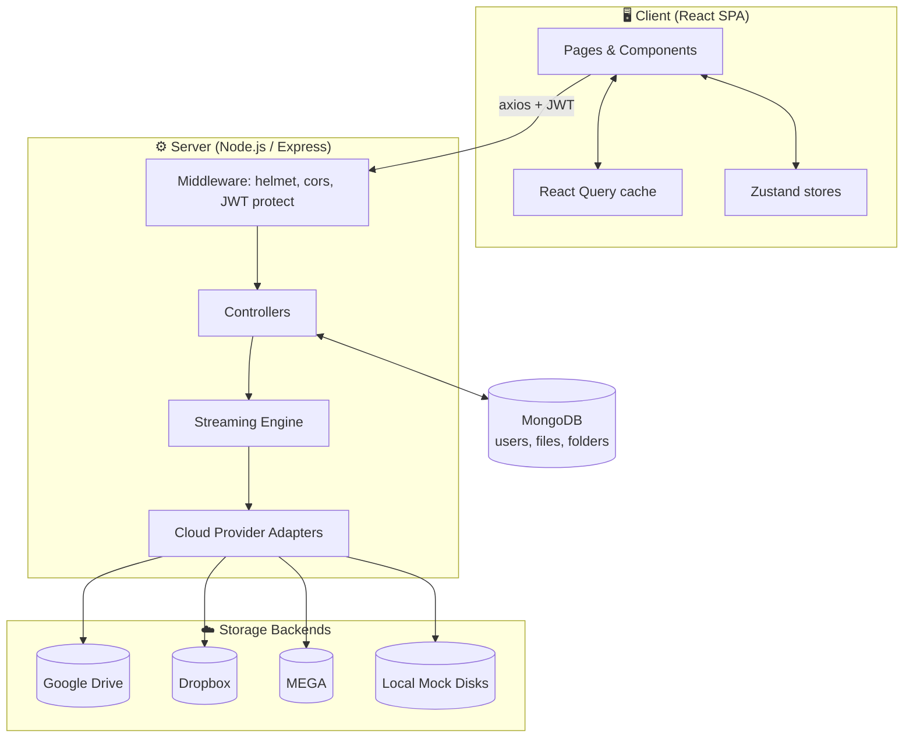
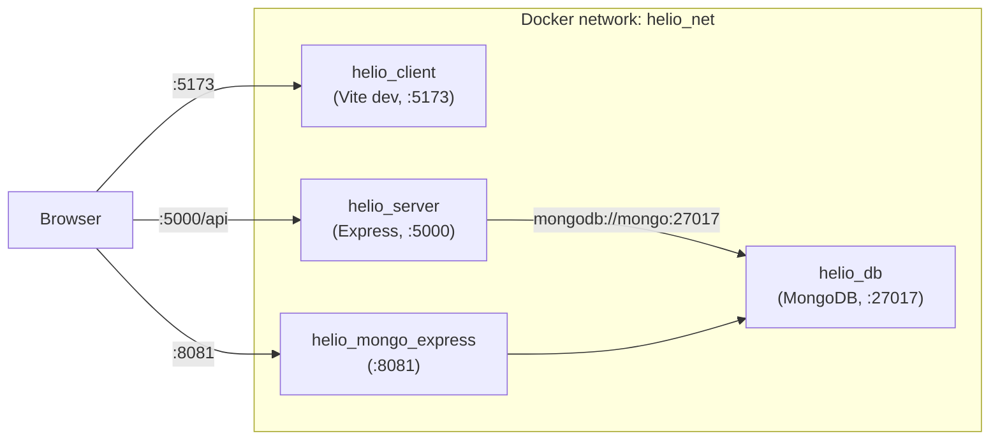
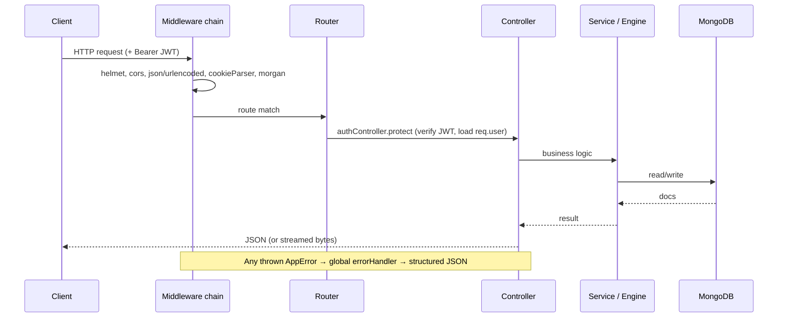
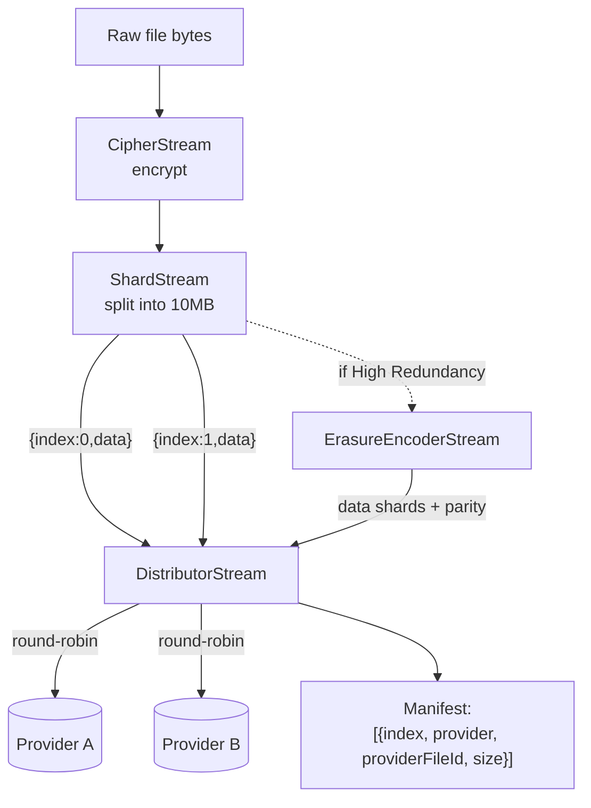
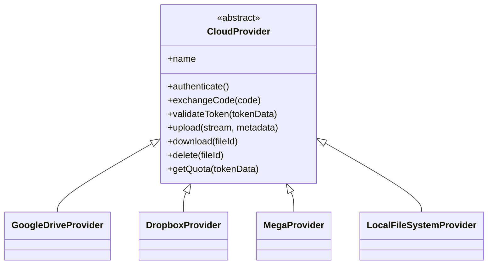
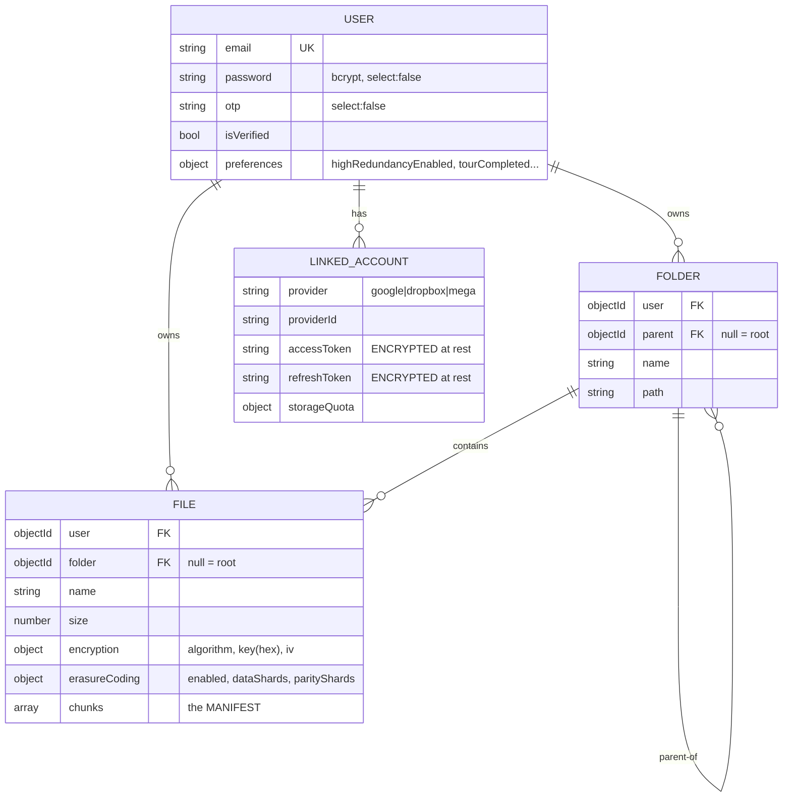
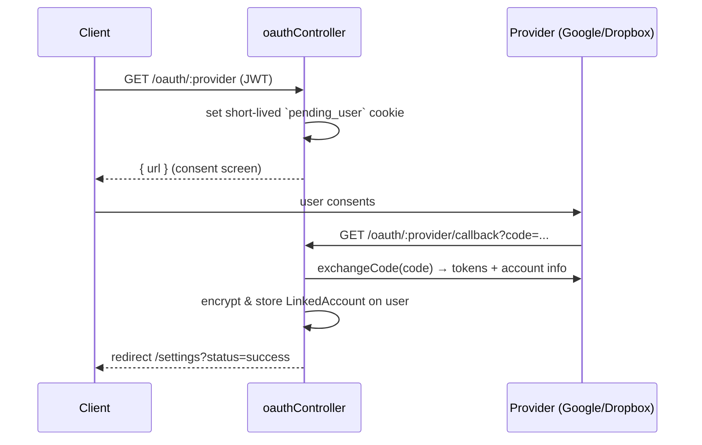
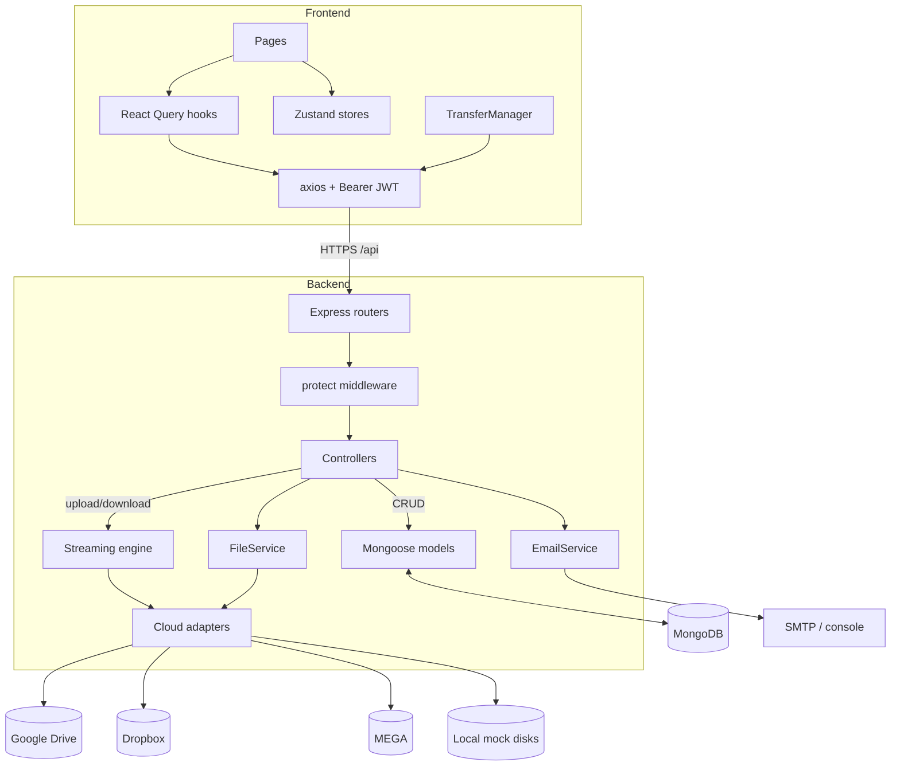

# HelioScape — Architecture

This document describes the complete architecture of HelioScape: the layers, the components inside each layer, how data is modeled, and — most importantly — **how everything connects**.

For the step-by-step data journeys, see [UPLOAD-FLOW.md](UPLOAD-FLOW.md) and [DOWNLOAD-FLOW.md](DOWNLOAD-FLOW.md). For the trust model, see [SECURITY.md](SECURITY.md).

---

## Table of Contents

- [1. System Overview](#1-system-overview)
- [2. Container / Deployment View](#2-container--deployment-view)
- [3. Backend Architecture](#3-backend-architecture)
- [4. The Streaming Engine](#4-the-streaming-engine)
- [5. Cloud Provider Abstraction](#5-cloud-provider-abstraction)
- [6. Frontend Architecture](#6-frontend-architecture)
- [7. Data Model](#7-data-model)
- [8. Authentication & Authorization](#8-authentication--authorization)
- [9. End-to-End Connection Map](#9-end-to-end-connection-map)
- [10. Key Design Decisions](#10-key-design-decisions)

---

## 1. System Overview

HelioScape is a three-tier web application:

- A **React SPA** (client) that users interact with.
- A **Node.js/Express API** (server) that owns all business logic, encryption, sharding, and provider communication.
- A **MongoDB** database that stores users, folders, file metadata, and — critically — the *manifest* that maps each encrypted shard to the provider holding it.

The server also talks outward to **external cloud providers** (Google Drive, Dropbox, MEGA) or, when no accounts are linked, to **local mock disks** on the server filesystem.



---

## 2. Container / Deployment View

Everything runs under Docker Compose. Four containers share a private bridge network `helio_net`:



| Container | Image / Build | Port | Role |
| :--- | :--- | :--- | :--- |
| `helio_client` | `./client` (node:18-alpine) | 5173 | Vite dev server serving the React app |
| `helio_server` | `./server` (node:18-alpine) | 5000 | Express API + streaming engine |
| `helio_db` | `mongo:latest` | 27017 | Primary datastore |
| `helio_mongo_express` | `mongo-express:latest` | 8081 | Web DB admin UI |

**Notes on the current setup** (from [docker-compose.yml](../docker-compose.yml)):
- Both app containers run in **dev mode** (`npm run dev`), not a production build, and use Docker Compose **`watch`** for hot reload (file sync + rebuild on dependency change).
- Persistent MongoDB data lives in named volumes `${PROJECT_NAME}_mongo_data` and `${PROJECT_NAME}_mongo_config`.
- The server reads secrets from the root `.env` (`env_file`) plus explicit `MONGO_URI` and `SMTP_*` environment variables injected by compose.

---

## 3. Backend Architecture

The server follows a conventional **routes → controllers → services → models** layering, plus a dedicated **engine** for stream processing.

```
server/src/
├── index.js                 # App bootstrap: middleware, route mounting, DB connect, crypto polyfill
├── config.js                # Central env-driven config (ports, Mongo URI, JWT, provider keys)
├── routes/                  # Express routers — thin, annotated with Swagger JSDoc
│   ├── authRoutes.js        # /api/auth/*
│   ├── userRoutes.js        # /api/users/*   (all protected)
│   ├── oauthRoutes.js       # /api/oauth/*
│   ├── uploadRoutes.js      # /api/files/*   (all protected)
│   ├── folderRoutes.js      # /api/folders/* (all protected)
│   └── providerRoutes.js    # /api/providers/* (all protected)
├── controllers/             # Request handling + orchestration
│   ├── authController.js     # register, login, OTP verify, reset, JWT `protect` middleware
│   ├── oauthController.js     # link/unlink providers, OAuth callback, MEGA login
│   ├── uploadController.js    # THE hub: upload pipeline, download pipeline, list, stats, rename, move
│   ├── folderController.js    # folder CRUD, recursive delete/move
│   ├── providerController.js  # aggregate quota across providers
│   └── userController.js      # profile update, password change
├── services/
│   ├── engine/              # ← the streaming engine (see §4)
│   ├── cloud/               # ← provider adapters (see §5)
│   ├── FileService.js       # shared file deletion (removes shards from every provider)
│   └── EmailService.js      # nodemailer OTP delivery (console fallback if no SMTP)
├── models/                  # Mongoose schemas: User, File, Folder
└── utils/                   # AppError, global errorHandler, swagger spec, constants
```

### Request lifecycle



**Global middleware** (in [index.js](../server/src/index.js), applied in order): `helmet()` → `cors({ origin: CLIENT_URL, credentials: true })` → `express.json({ limit: "500mb" })` → `express.urlencoded` → `cookieParser()` → `morgan("dev")`. A `crypto` polyfill sets `global.crypto` / `getRandomValues` so the `megajs` library works under Node 18.

**Error handling**: Controllers wrap logic in try/catch and forward failures via `next(err)`. Everything funnels into [utils/errorHandler.js](../server/src/utils/errorHandler.js), which normalizes Mongoose cast/duplicate/validation errors and JWT errors into `AppError`s, and returns dev-verbose vs prod-safe responses based on `NODE_ENV`.

---

## 4. The Streaming Engine

The engine is the heart of HelioScape. It is a set of Node.js `stream.Transform` / `stream.Writable` classes that are piped together. Because everything is a stream, a large file flows through the server in small windows and is never held in memory whole.

Location: [server/src/services/engine/](../server/src/services/engine/)

| Class | Type | Responsibility |
| :--- | :--- | :--- |
| `CipherStream` | Transform | Encrypts bytes with **AES-256-GCM**. Prepends a 16-byte IV, appends a 16-byte auth tag. |
| `DecipherStream` | Transform | Reverses the above: reads IV, decrypts, verifies auth tag on flush. |
| `ShardStream` | Transform (object out) | Buffers bytes and emits fixed-size **10 MB** `{ index, data }` chunk objects. |
| `ErasureEncoderStream` | Transform (object) | *Optional.* Groups N data shards and emits one XOR **parity** shard (RAID-5). |
| `ErasureDecoderStream` | Transform (object) | *Optional.* Reconstructs a single missing shard per group from parity. |
| `DistributorStream` | Writable (object in) | Uploads each shard to a provider (round-robin), tracks a manifest, retries/rolls back on failure. |

### Encryption stream format

`CipherStream` produces a self-describing byte layout so the file can be decrypted later using only the stored key:

```
┌────────────┬──────────────────────────┬──────────────┐
│  IV        │  Encrypted payload       │  Auth Tag    │
│  16 bytes  │  (variable)              │  16 bytes    │
└────────────┴──────────────────────────┴──────────────┘
```

This is why the download controller computes `Content-Length` as `file.size - 32` (16 IV + 16 tag).

### How shards, parity, and the distributor relate



**DistributorStream** ([DistributorStream.js](../server/src/services/engine/DistributorStream.js)) is the most operationally important piece:
- **Round-robin**: it keeps a `currentProviderIndex` and rotates through the provider list shard by shard.
- **Failover**: if a shard upload throws, it advances to the next provider and retries — up to `providers.length` attempts per shard.
- **Rollback**: if *all* providers fail for a shard, it deletes every shard already uploaded for that file and errors out, so no orphaned fragments are left behind.
- **Manifest**: on success it records `{ index, provider, providerId, providerFileId, size }` per shard; `getManifest()` returns the sorted chunk list that gets written to MongoDB.

> RAID-5 details, including how parity shards are indexed (e.g. `"0-3-parity"`) and reconstructed, are covered in [DOWNLOAD-FLOW.md](DOWNLOAD-FLOW.md#raid-5-recovery).

---

## 5. Cloud Provider Abstraction

All storage backends implement a common interface via the **Adapter pattern**, so the engine treats Google Drive, Dropbox, MEGA, and local disks identically.

Location: [server/src/services/cloud/](../server/src/services/cloud/)



| Adapter | Auth model | Where shards land | Notes |
| :--- | :--- | :--- | :--- |
| `GoogleDriveProvider` | OAuth 2.0 (`googleapis`) | hidden **appDataFolder** | Auto-refreshes tokens; emits `tokens` event → controller persists new tokens. Scopes: `drive.appdata`, `drive.metadata.readonly`, `userinfo.*`. |
| `DropboxProvider` | OAuth 2.0 (`dropbox` SDK) | `/HelioScape_Vault_DO_NOT_DELETE/` | SDK auto-refreshes with stored refresh token; download uses raw `fetch` for true streaming. |
| `MegaProvider` | **Credentials proxy** (`megajs`) | `HelioScape_Vault_DO_NOT_DELETE` folder | MEGA is zero-knowledge, so email+password (encrypted at rest) are re-used to log in "on the fly" per operation. |
| `LocalFileSystemProvider` | none | `server/storage_mock/disk1`, `disk2` | Fallback when no accounts are linked; makes the app fully runnable with zero setup. |

**The "credentials proxy" for MEGA**: Because MEGA derives the decryption key from the account password, the server cannot use a stateless OAuth token — it needs the password to read/write. HelioScape stores the `{email, password}` JSON as the account's `accessToken`, which the `User` model **encrypts at rest** with `mongoose-field-encryption`. See [SECURITY.md](SECURITY.md).

---

## 6. Frontend Architecture

A single-page React 18 app built with Vite. It holds **no business logic** — it is a view/controller over the API.

```
client/src/
├── main.jsx           # StrictMode → ErrorBoundary → QueryClientProvider → App
├── App.jsx            # Router + route table; toggles dark class from theme store
├── pages/             # One component per route (see table below)
├── components/
│   ├── ui/            # shadcn/ui (Radix) primitives + ConfirmDialog, Loading, ErrorBoundary
│   ├── layout/        # Sidebar, Navbar, Layout, ProtectedRoute, GlobalDragDrop, LandingNavbar
│   ├── dashboard/     # NetworkTopology, TransferManager, UploadZone, ProviderCard, StorageMeter...
│   └── landing/       # DashboardPreview
├── hooks/             # React Query hooks (files, folders, user, upload mutation)
├── store/             # Zustand stores (auth, transfer, theme, search, upload)
├── services/          # authService.js (axios calls)
├── lib/utils.js       # cn(), formatBytes()
└── constants.js       # API_BASE_URL, APP_NAME, THEME, ROUTES
```

### State management split

HelioScape deliberately separates **server state** from **client state**:

- **Server state → TanStack React Query.** Files, folders, user profile, quotas. Query keys: `["files", folderId]` (infinite), `["folders", parentId]`, `["folder", id]`, `["user"]`, `["quota"]`. Mutations invalidate the relevant keys so the UI stays fresh.
- **Client/UI state → Zustand.** Five stores:

| Store | Persisted? | Holds |
| :--- | :--- | :--- |
| `useAuthStore` | ✅ localStorage, **AES-encrypted** (crypto-js) under key `auth-storage` | `user`, `token`, `isAuthenticated` |
| `useThemeStore` | ✅ localStorage (plain) `theme-storage-v2` | `theme` (default dark) |
| `useTransferStore` | ❌ | upload & download queues (the **live** transfer engine state) |
| `useUploadStore` | ❌ | older upload-only queue (legacy; not mounted in current layout) |
| `useSearchStore` | ❌ | global search term |

> The JWT is persisted to `localStorage` but AES-encrypted with `crypto-js` before writing. The encryption key comes from `VITE_STORAGE_KEY` and falls back to a hardcoded literal if unset — see [SECURITY.md](SECURITY.md).

### Routes

| Path | Component | Guard |
| :--- | :--- | :--- |
| `/` | LandingPage | public (redirects to `/dashboard` if logged in) |
| `/login`, `/register` | Login, Register | public |
| `/verify-email`, `/forgot-password`, `/reset-password` | OTP / password flows | public |
| `/oauth/callback` | OAuthCallback | public (handles provider redirect) |
| `/dashboard` | Dashboard | 🔒 protected |
| `/files` | Files (file manager) | 🔒 |
| `/media` | Media gallery | 🔒 |
| `/visualizer` | Network topology | 🔒 |
| `/distribution/files` | File storage map | 🔒 |
| `/distribution/accounts` | Per-account usage | 🔒 |
| `/distribution/accounts/:provider/:providerId` | AccountDetails | 🔒 |
| `/settings` | Connected accounts, redundancy toggle | 🔒 |
| `/profile` | Profile & password | 🔒 |
| `*` | NotFound | — |

Protection is **client-side** via `ProtectedRoute` (checks `isAuthenticated`; forces `/verify-email` if `user && !user.isVerified`). The real security boundary is the server's JWT `protect` middleware — the client guard is purely UX.

### The live transfer manager

`TransferManager` (mounted globally in `Layout`) is the client-side counterpart to the server's distributor. It drives `useTransferStore`:
- Processes the **upload queue** one item at a time via `useUploadMutation` (POST `/files` multipart), reporting progress and supporting cancel via `AbortController`.
- Processes the **download queue** via `GET /files/:id/download`, turning the returned blob into an object URL and triggering a browser download.
- Invalidates `["files"]` and `["quota"]` on success so the dashboard reflects new usage.

`GlobalDragDrop` (also in `Layout`) captures window-level drag/drop, blocks upload with a toast if the user has no linked accounts, and otherwise enqueues files into the transfer store targeted at the current folder.

---

## 7. Data Model

Three Mongoose collections. The **File** document is where the aggregation magic is recorded.



### The manifest (`File.chunks`)

Each element maps one shard to its physical location:

```js
{
  index: 0,                       // Number for data shards; String like "0-3-parity" for parity
  type: "data",                   // "data" | "parity"
  provider: "google-1088...",     // "<provider>-<providerId>", or "local-1"/"local-2"
  providerFileId: "1AbC...",      // the ID/path the provider returned
  size: 10485760                  // bytes
}
```

Reassembly = read `chunks`, sort by `index`, fetch each from its `provider`, decrypt. That's the entire "download" idea in one sentence.

**Notable schema facts:**
- `User.password` and `User.otp*` use `select: false` — never returned unless explicitly requested.
- `LinkedAccountSchema` applies `mongoose-field-encryption` to `accessToken` and `refreshToken` using `JWT_SECRET` as the encryption secret.
- `File.encryption.key` also uses `select: false`; the download controller must `.select("+encryption.key")` to read it.
- `Folder` has a compound unique index `{ user, parent, name }` so names can't collide within the same directory.

---

## 8. Authentication & Authorization

### User authentication (app login)

```mermaid
sequenceDiagram
    participant U as User
    participant API as authController
    participant DB as MongoDB
    participant Mail as EmailService

    U->>API: POST /auth/register {email, password}
    API->>DB: create user (isVerified=false), store OTP
    API->>Mail: sendOTP(email, otp)
    U->>API: POST /auth/verify-email {email, otp}
    API->>DB: match OTP + not expired → isVerified=true
    API-->>U: { token (JWT, 10d), user }
    Note over U,API: Later logins: if verified → token; else re-issue OTP
```

- Passwords hashed with **bcrypt** (cost 12) via a Mongoose pre-save hook.
- **OTP** is a 6-digit code, valid 10 minutes, delivered by email (or logged to console if no SMTP).
- JWT is signed with `JWT_SECRET`, expires in **10 days**, and carries only `{ id }`.
- `authController.protect` extracts the `Bearer` token, verifies it, loads the user, and attaches `req.user`. It guards every `/users`, `/files`, `/folders`, `/providers` route and most `/oauth` routes.

### Provider authorization (OAuth linking)



MEGA skips OAuth entirely: `POST /oauth/mega/login` verifies the credentials by logging in immediately, then stores the encrypted credentials proxy.

---

## 9. End-to-End Connection Map

Putting every layer together — who calls whom:



**Trace of a single uploaded file:**
`UploadZone` → `useTransferStore` → `TransferManager` → `useUploadMutation` → `POST /api/files` → `protect` → `uploadController.uploadFile` → `Busboy` → `CipherStream` → `ShardStream` → (`ErasureEncoderStream`) → `DistributorStream` → cloud adapters → providers; then the manifest is written to `File` in MongoDB.

---

## 10. Key Design Decisions

| Decision | Why | Trade-off / caveat |
| :--- | :--- | :--- |
| **Server-side streaming pipeline** | Constant memory for huge files; no temp files on disk. | The server sees plaintext in transit (it does the encryption). |
| **Round-robin striping (RAID-0 style)** | Maximizes combined capacity and spreads load. | Losing one provider loses the file — unless RAID-5 mode is on. |
| **Optional RAID-5 XOR parity** | Survives one missing shard per group. | +25% storage overhead (with 4 data shards); recovers only 1 loss per group. |
| **Adapter pattern for providers** | Engine is provider-agnostic; adding a backend = one new class. | Each provider has quirks (streaming, refresh, folders) handled inside its adapter. |
| **Local mock disks fallback** | App is fully usable with zero external setup. | Not real distribution; for dev/demo only. |
| **React Query + Zustand split** | Clean separation of server vs UI state. | Two transfer stores exist (`useTransferStore` is live; `useUploadStore` is legacy). |
| **Per-file random AES key** | Compromising one file's key doesn't expose others. | Keys are currently stored in DB (see SECURITY.md) — not yet zero-knowledge. |

---

## See also

- [UPLOAD-FLOW.md](UPLOAD-FLOW.md) — the write path, in detail, with diagrams.
- [DOWNLOAD-FLOW.md](DOWNLOAD-FLOW.md) — the read path + RAID-5 recovery.
- [SECURITY.md](SECURITY.md) — encryption model and honest threat analysis.
- [PROVIDERS.md](PROVIDERS.md) — per-provider behavior and API-key setup.
- [API.md](API.md) — full REST reference.
- [FAQ.md](FAQ.md) — 30 answered questions.
