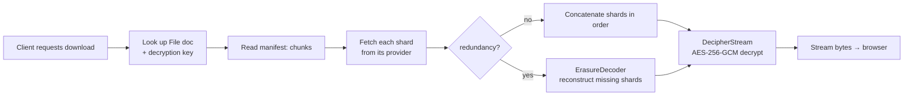
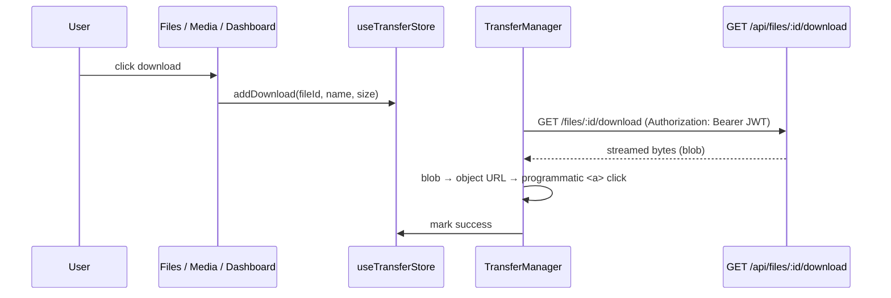
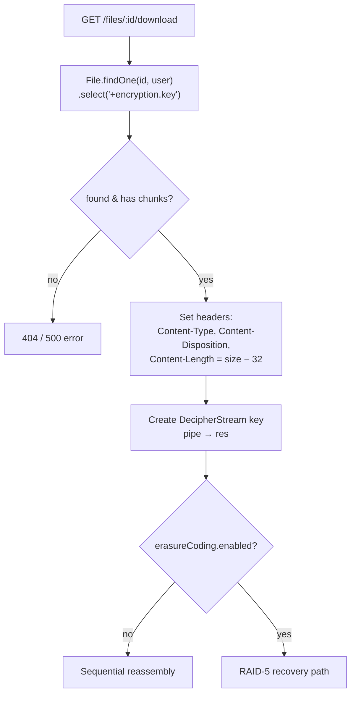
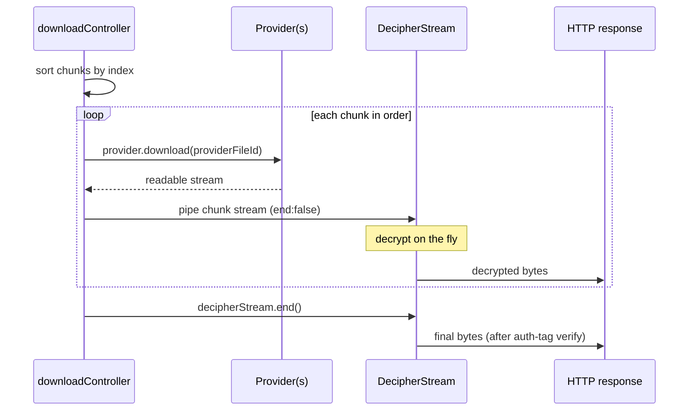
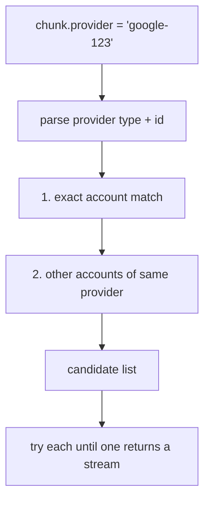
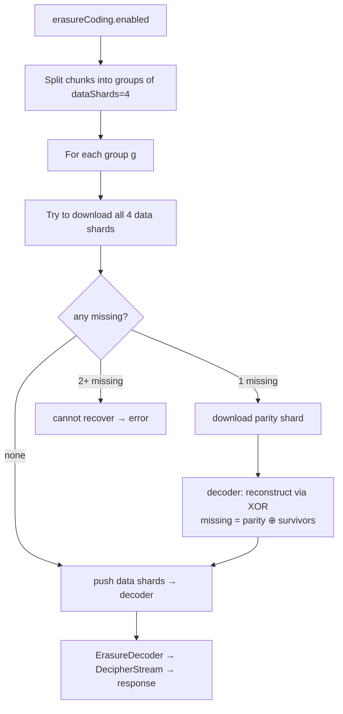
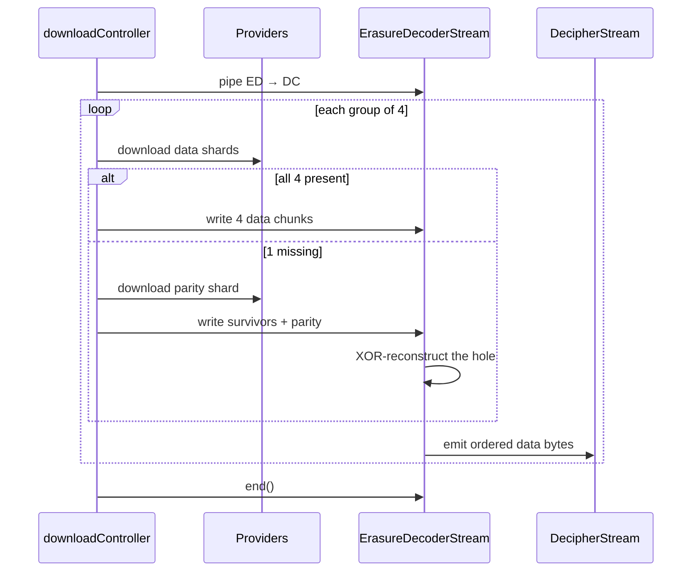
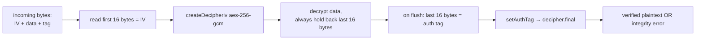
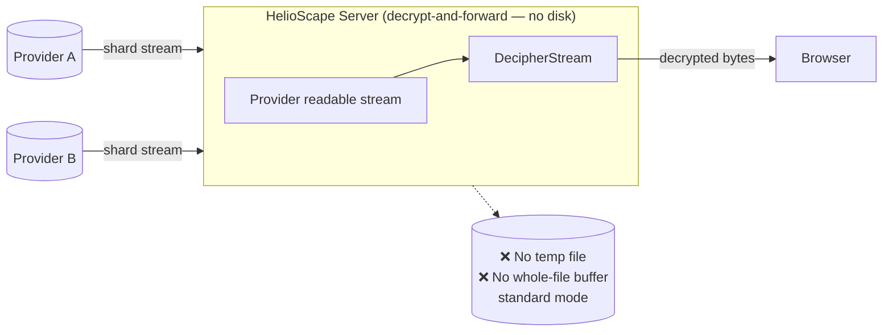
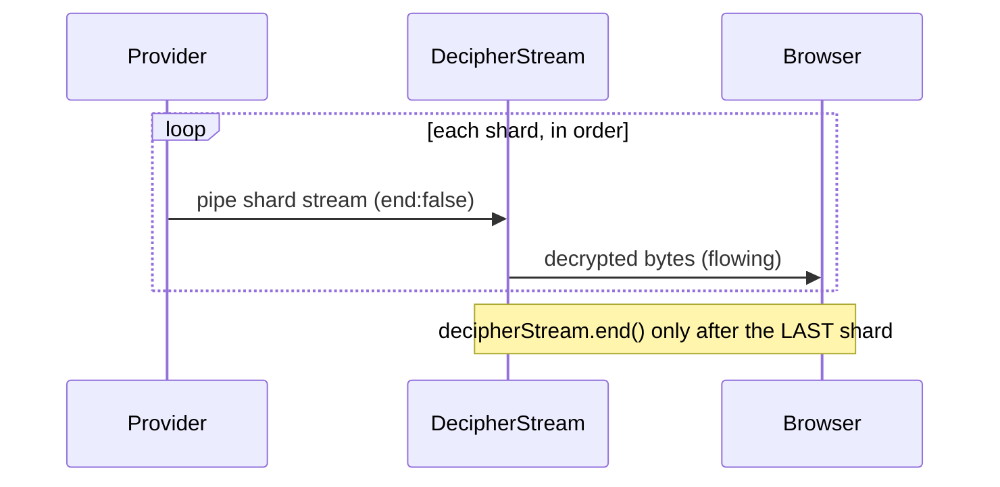

# HelioScape — Download Flow

This document traces a file from a download request back to a fully reassembled, decrypted stream in the user's browser — including how missing shards are recovered in High-Redundancy mode.

Related: [UPLOAD-FLOW.md](UPLOAD-FLOW.md) · [ARCHITECTURE.md](ARCHITECTURE.md) · [SECURITY.md](SECURITY.md)

---

## Table of Contents

- [1. The Big Picture](#1-the-big-picture)
- [2. Client Side](#2-client-side)
- [3. Server Side: Lookup & Setup](#3-server-side-lookup--setup)
- [4. Standard Download (Sequential Reassembly)](#4-standard-download-sequential-reassembly)
- [5. Provider Resolution & Failover](#5-provider-resolution--failover)
- [6. RAID-5 Recovery](#6-raid-5-recovery)
- [7. Decryption & Integrity](#7-decryption--integrity)
- [8. Failure Modes](#8-failure-modes)
- [9. Does the Server Download My File First? (Memory & Disk)](#9-does-the-server-download-my-file-first-memory--disk)
- [10. Quick Reference](#10-quick-reference)

---

## 1. The Big Picture

Download is the mirror image of upload: instead of *encrypt → shard → distribute*, it's *collect → reassemble → decrypt*.

> 💡 **The client never contacts the cloud providers, and the server never stages the file on disk.** The browser only talks to the HelioScape server; the server acts as a **decrypt-and-forward relay**, pulling shards and streaming the decrypted result straight to the browser as bytes arrive. The HTTP response to the client is opened **before any shard is fetched**. See [§9 — Does the Server Download My File First?](#9-does-the-server-download-my-file-first-memory--disk).



---

## 2. Client Side

Downloads run through the same `TransferManager` / `useTransferStore` that handles uploads, but the download path fetches a **blob** and triggers a browser save.



- Downloads are **deduplicated** by file id in the store (`addDownload` ignores duplicates).
- The Media page uses the same endpoint for **thumbnails/previews**, with a module-level blob cache to avoid re-fetching.

---

## 3. Server Side: Lookup & Setup

Entry point: `uploadController.downloadFile` in [uploadController.js](../server/src/controllers/uploadController.js).



Key setup facts:
- The decryption key is normally hidden (`select: false`); download explicitly requests it with `.select("+encryption.key")`.
- `Content-Length` is set to `size − 32` to account for the 16-byte IV + 16-byte auth tag that are *not* part of the original file.
- A single `DecipherStream` is created and piped to the response; both download modes feed into it.

---

## 4. Standard Download (Sequential Reassembly)

For files without redundancy, shards are fetched **in index order** and piped sequentially into the decipher stream.



The `{ end: false }` option is essential: each shard stream is piped into the decipher **without closing it**, so all shards concatenate into one continuous decrypted output. Only after the last shard does the controller call `decipherStream.end()`.

---

## 5. Provider Resolution & Failover

A shard's `provider` field looks like `google-<providerId>`, `dropbox-<providerId>`, `mega-<providerId>`, or `local-1`/`local-2`. The controller's `getCandidateProviders(chunk)` turns that into an **ordered list of adapters to try**:



- **Cross-account failover**: if the original Google account is unavailable, HelioScape will try the user's *other* Google accounts for the same shard. Same for Dropbox and MEGA.
- Local shards resolve to the matching mock disk.
- This resolution logic is shared in spirit with `FileService.deleteFile`, which uses the same provider-prefix parsing to delete shards on file removal.

---

## 6. RAID-5 Recovery

When `erasureCoding.enabled` is true, the download path uses `ErasureDecoderStream` to tolerate a missing shard per group. This is the payoff for the +25% storage cost paid at upload.

### The recovery idea

RAID-5 parity is a running XOR. If one shard in a group is lost, it equals the XOR of the parity shard and all the *surviving* data shards:

```
missing = parity ⊕ present₁ ⊕ present₂ ⊕ present₃
```

### The flow





### Limits (from [ErasureDecoderStream.js](../server/src/services/engine/ErasureDecoderStream.js))

- Recovers **at most one** missing shard per group. Two or more missing in the same group → unrecoverable, and the decoder throws.
- Requires the parity shard to be present when a data shard is missing.
- Parity shards are matched by their string index (`"<start>-<end>-parity"`) and grouped by `floor(index / dataShards)`.

---

## 7. Decryption & Integrity

`DecipherStream` ([DecipherStream.js](../server/src/services/engine/DecipherStream.js)) reverses `CipherStream` exactly:



- The stream **buffers the trailing 16 bytes** at all times, because the GCM auth tag is the final 16 bytes of the whole stream — it can't be treated as ciphertext.
- `decipher.final()` throws if the auth tag doesn't verify, so **tampered or corrupted data fails loudly** rather than returning garbage.

---

## 8. Failure Modes

| Situation | Behavior |
| :--- | :--- |
| File not found / not owned by user | `404 File not found` |
| File has no chunks | `500 File corruption: No chunks found` |
| A shard's provider is down (standard mode) | Tries other accounts of the same provider; if none work → stream error |
| One shard missing (RAID-5 mode) | Reconstructed from parity |
| Two+ shards missing in one group (RAID-5) | Unrecoverable → decoder throws |
| Auth tag mismatch (corruption/tampering) | `DecipherStream` errors on `final()` |
| Error after headers already sent | Stream is destroyed; a clean HTTP error can't be sent |

---

## 9. Does the Server Download My File First? (Memory & Disk)

A natural question: *"You can't stream a file to the client before you have the data — so does the server download the whole file to itself first, then send it?"*

**No.** Two things make this work without staging the file:

### 1. The response is opened *before* any data exists

HTTP response bodies are streamed. The controller wires the pipe to the client **first**, then starts fetching shards ([uploadController.js](../server/src/controllers/uploadController.js)):

```js
res.setHeader("Content-Length", file.size - 32); // total size known up front
const decipherStream = new DecipherStream(key);
decipherStream.pipe(res);                          // ← connected to client BEFORE any shard is fetched
// ...only now does the loop start pulling shards from providers
```

The connection is held open and the body is written progressively. The client doesn't need the whole file to begin receiving — it just needs the open connection (and the `Content-Length`, which the server already knows: `file.size − 32`, subtracting the 16-byte IV + 16-byte GCM tag).

### 2. Shards flow *through* the server, not *into* it



`provider.download()` returns a **readable stream** (Google's response stream, Dropbox's `response.body`, or the local `fs.createReadStream`) — the shard is **not** fully buffered. Each shard is piped into the decipher with `{ end: false }` so they concatenate into one continuous output, and the decipher is only closed after the last shard ([uploadController.js](../server/src/controllers/uploadController.js)):



At any instant the server holds only **~1 shard in flight (~10 MB)** — never the whole file, and nothing on disk.

### The one exception: RAID-5 mode

If the file was stored with High Redundancy, the recovery path **must** buffer whole shards, because XOR reconstruction needs every byte of a group to rebuild a missing shard:

```
missing = parity ⊕ present₁ ⊕ present₂ ⊕ present₃
```

It uses a `streamToBuffer` helper to hold **one group at a time** (~4–5 shards ≈ 40–50 MB), reconstructs any hole, feeds the group into the decipher stream, then moves on. Still **one group at a time**, still **nothing on disk**.

| Mode | Peak transient RAM | Disk writes | Client streamed progressively? |
| :--- | :--- | :--- | :--- |
| Standard | ~1 shard (~10 MB) | none | ✅ yes |
| RAID-5 | ~1 group (4–5 shards ≈ 40–50 MB) | none | ✅ yes |

> **Takeaway:** the server is a **decrypt-and-forward proxy**. It briefly relays each shard (or group) through memory while streaming to the client — it does **not** download the whole file to itself first.

---

## 10. Quick Reference

| Item | Value | Source |
| :--- | :--- | :--- |
| Download endpoint | `GET /api/files/:id/download` | `uploadRoutes.js` |
| Reassembly order | shards sorted by `index` | `downloadFile` |
| Decryption | AES-256-GCM, key from `File.encryption.key` | `DecipherStream` |
| Content-Length | `file.size − 32` (strip IV + tag) | `downloadFile` |
| Cross-account failover | tries all accounts of the shard's provider | `getCandidateProviders` |
| RAID-5 tolerance | 1 missing shard per group of 4 | `ErasureDecoderStream` |
| Integrity guarantee | GCM auth tag verified on flush | `DecipherStream._flush` |
