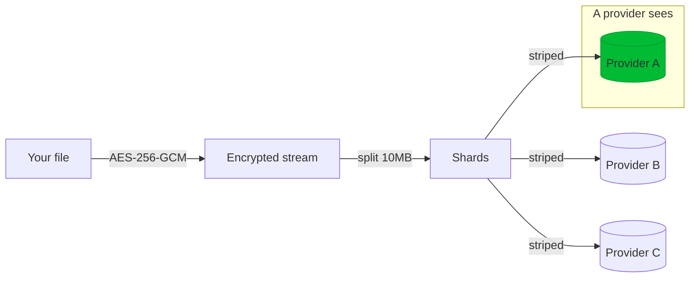

# HelioScape — Security Model

An honest description of what HelioScape protects, what it does **not**, and the roadmap to close the gaps. HelioScape is an educational / portfolio project — this document is written to be truthful about its current limitations rather than to market it.

- [TL;DR](#tldr)
- [What's protected](#whats-protected)
- [File encryption (AES-256-GCM)](#file-encryption-aes-256-gcm)
- [The key-storage problem](#the-key-storage-problem-most-important)
- [Credential storage](#credential-storage)
- [Password & session security](#password--session-security)
- [Threat model](#threat-model)
- [Roadmap](#roadmap)

---

## TL;DR

| Claim | Reality |
| :--- | :--- |
| "Providers can't read my files" | ✅ True — each provider only holds encrypted, sharded fragments. |
| "No single provider has the whole file" | ✅ True — shards are striped across accounts. |
| "Zero-knowledge / end-to-end encrypted" | ❌ **Not currently** — the server stores per-file keys in plaintext, so the server (and anyone with DB access) can decrypt. |
| "My cloud tokens are safe in the DB" | ⚠️ Partly — tokens are encrypted at rest, but with `JWT_SECRET` as the key. |
| "My login password is safe" | ✅ Hashed with bcrypt (cost 12), never stored in plaintext. |

**Bottom line:** HelioScape today provides **encryption-at-provider**, not zero-knowledge encryption. Don't store data you can't afford to have exposed to whoever controls the server or database.

---

## What's protected



Against a **curious or breached cloud provider**, HelioScape is strong: a provider holds only encrypted fragments, never the whole file and never the key. Fragmentation + encryption together mean a single compromised provider yields nothing readable.

---

## File encryption (AES-256-GCM)

Implemented in [CipherStream.js](../server/src/services/engine/CipherStream.js) / [DecipherStream.js](../server/src/services/engine/DecipherStream.js).

- **Algorithm:** AES-256-GCM (authenticated encryption).
- **Key:** a fresh **32-byte** key from `crypto.randomBytes(32)` per file.
- **IV:** a **16-byte** IV, generated per file and **prepended** to the ciphertext stream.
- **Auth tag:** the **16-byte** GCM tag is **appended** on flush.
- **On-disk layout of the encrypted payload:** `IV (16) ‖ ciphertext ‖ tag (16)`.
- **Integrity:** on download, `decipher.final()` verifies the tag — tampered or corrupted data fails loudly instead of returning garbage.

This part of the design is solid. The weakness is not the crypto — it's where the key lives.

---

## The key-storage problem (most important)

When a file is saved, the controller writes the key like this ([uploadController.js](../server/src/controllers/uploadController.js)):

```js
encryption: {
  algorithm: "aes-256-gcm",
  key: key.toString("hex"),   // ⚠️ plaintext hex — flagged INSECURE / TODO in the code
}
```

The per-file AES key is stored **in plaintext hex in MongoDB**, right next to the manifest that says where every shard lives. The code itself marks this with a `TODO`/`INSECURE` comment.

**Consequences:**
- Anyone with **database read access** (an operator, a backup leak, a Mongo misconfiguration, an injection) can retrieve both the key *and* the shard map, then pull the shards and decrypt the file.
- Therefore the "zero-knowledge" framing from older docs is **inaccurate** for the current build. The honest description is **encryption-at-provider**.

This is the single most important thing to fix before anyone trusts HelioScape with real data. See [Roadmap](#roadmap).

---

## Credential storage

Cloud credentials live on the `User.linkedAccounts` subdocument ([User.js](../server/src/models/User.js)) and **are encrypted at rest** using `mongoose-field-encryption`:

```js
LinkedAccountSchema.plugin(fieldEncryption, {
  fields: ["accessToken", "refreshToken"],
  secret: config.JWT_SECRET,   // "Using JWT_SECRET for now, ideally separate DB_SECRET"
});
```

- **OAuth providers** (Google, Dropbox): the access/refresh tokens are the encrypted `accessToken`/`refreshToken` fields.
- **MEGA:** the encrypted `accessToken` holds a JSON blob `{ email, password }` — the "credentials proxy." This means your **MEGA password** is stored (encrypted) on the server. See [PROVIDERS.md — MEGA](PROVIDERS.md#mega).

⚠️ **Caveats:**
- The encryption secret is currently **`JWT_SECRET`**, reused for both signing JWTs and encrypting DB fields. The code comment itself notes a dedicated `DB_SECRET` would be better.
- If `JWT_SECRET` is unset, `config.js` falls back to the literal `"default_secret"` — which would make both JWTs and encrypted fields trivially forgeable/decryptable. **Always set a strong `JWT_SECRET`.**

---

## Password & session security

**Login passwords** ([User.js](../server/src/models/User.js)):
- Hashed with **bcrypt, cost factor 12**, in a `pre("save")` hook.
- The `password` field is `select: false` — excluded from queries by default.
- Minimum length 8.

**Email OTP verification** (`authController`):
- 6-digit OTP, valid **10 minutes**, stored `select: false`.
- Used for email verification, optional login verification, and password reset.
- If SMTP isn't configured, the OTP is printed to **server logs** (dev convenience).

**JWT sessions:**
- Signed with `JWT_SECRET`, **10-day** lifetime.
- Sent as `Authorization: Bearer <token>`.

**Client-side token storage** (`useAuthStore.js`):
- The JWT is stored in `localStorage` but **AES-encrypted with crypto-js** first.
- ⚠️ The encryption key comes from `VITE_STORAGE_KEY` and **falls back to a hardcoded literal** if unset — so this is obfuscation, not a hard guarantee. It also does not defend against XSS, which can call the same decryption path.

**Transport / app hardening** ([index.js](../server/src/index.js)):
- `helmet` for security headers, `cors` restricted to `CLIENT_URL`, `morgan` request logging, 500 MB body limit.
- Runs over HTTP in local dev — put it behind TLS for any real deployment.

---

## Threat model

| Adversary | Can they read your files? | Why |
| :--- | :--- | :--- |
| A single cloud provider (curious/breached) | ❌ No | Holds only encrypted shards, no key, not the whole file. |
| Network eavesdropper (with TLS) | ❌ No | Traffic encrypted in transit. |
| Network eavesdropper (plain HTTP dev) | ⚠️ Maybe | Use TLS in production. |
| Someone with **database access** | ✅ **Yes** | Keys are stored in plaintext next to the manifest. |
| Someone who compromises the **server** | ✅ **Yes** | Server sees keys and decrypted streams. |
| Attacker without `JWT_SECRET` | ❌ No (to tokens) | Encrypted-at-rest tokens; but a weak/default secret breaks this. |
| XSS in the browser | ⚠️ Yes (session) | Can reach the decrypted JWT in `localStorage`. |

The design **defeats the provider-level threat** — which is the whole point of a meta-cloud — but **does not defeat a compromised server or database**.

---

## Roadmap

The gap between "encryption-at-provider" and true zero-knowledge is closable:

1. **Stop storing plaintext file keys.** Wrap each per-file key with a **master key derived from the user's password** (e.g. Argon2/PBKDF2 → KEK), so the DB never holds a usable decryption key. This is the top priority.
2. **Separate secrets.** Introduce a dedicated `DB_SECRET` for `mongoose-field-encryption` instead of reusing `JWT_SECRET`, and fail fast (refuse to boot) if secrets are unset rather than falling back to `"default_secret"`.
3. **Client-side encryption option.** Encrypt in the browser before upload for users who want the server never to see plaintext (at the cost of server-side previews/thumbnails).
4. **Harden client token storage.** Prefer httpOnly cookies over `localStorage`; at minimum require `VITE_STORAGE_KEY` with no hardcoded fallback.
5. **TLS by default** in any non-local deployment.

Until at least (1) and (2) land, treat HelioScape as a demonstration of distributed, streaming, encrypted storage — **not** as a vault for sensitive data.

---

Related: [ARCHITECTURE.md](ARCHITECTURE.md) · [UPLOAD-FLOW.md](UPLOAD-FLOW.md) · [DOWNLOAD-FLOW.md](DOWNLOAD-FLOW.md) · [FAQ.md](FAQ.md)
