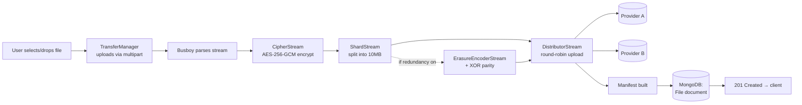
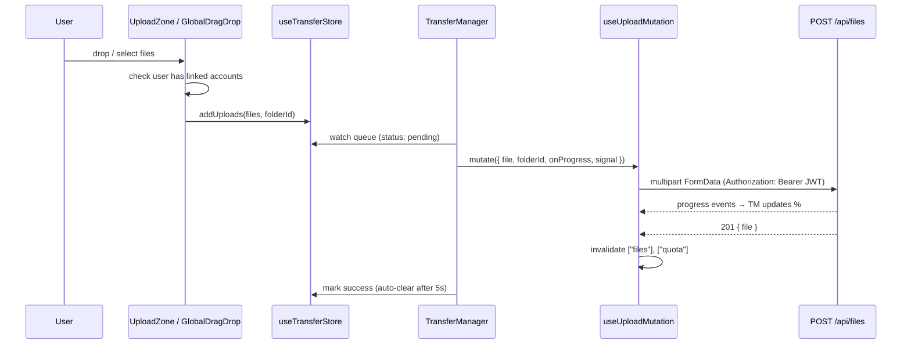
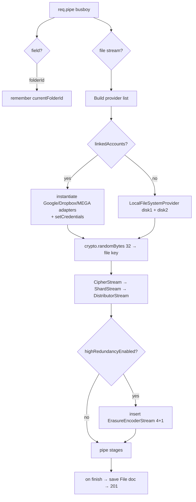
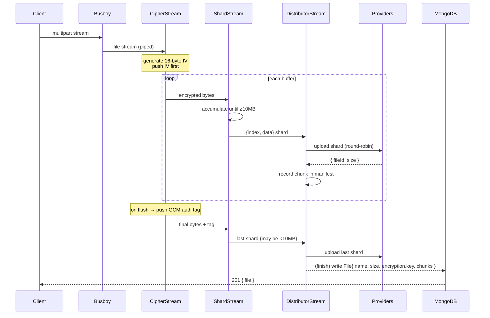
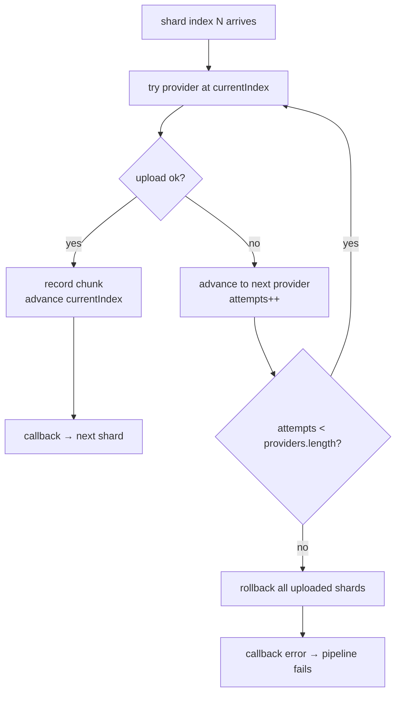
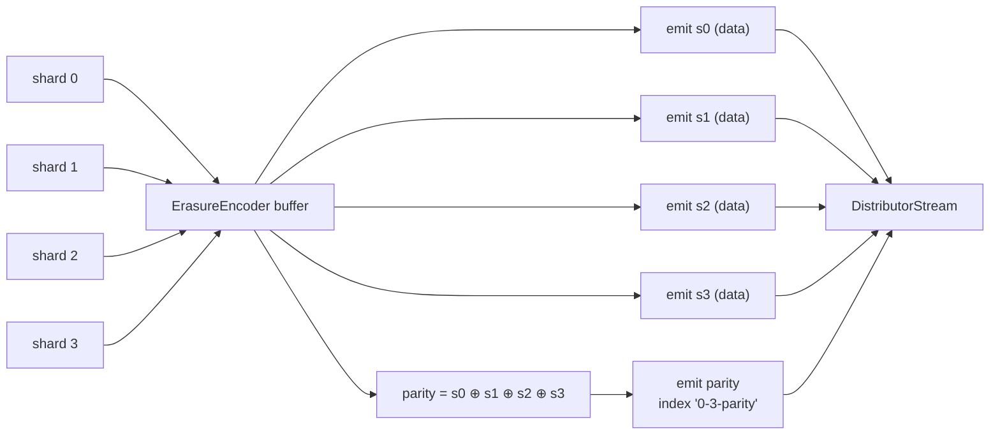
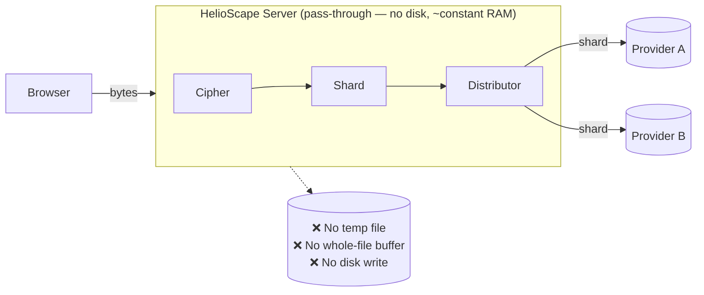
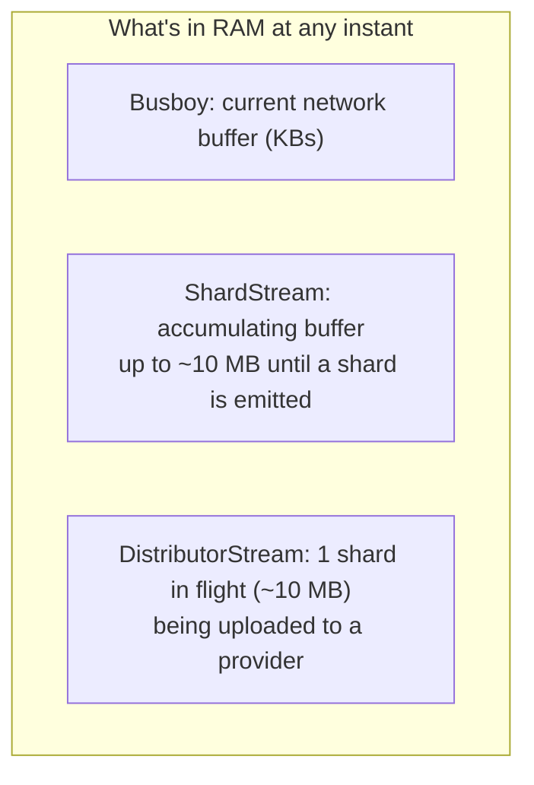
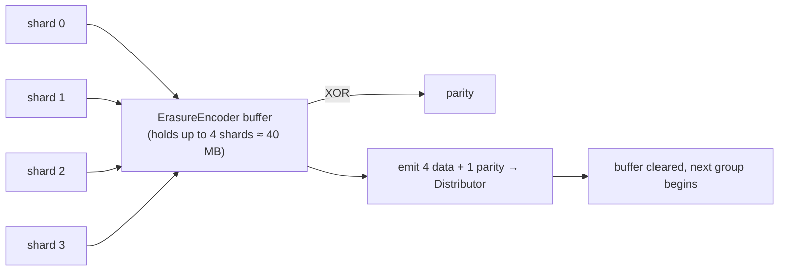

# HelioScape — Upload Flow

This document traces a file from the moment a user drops it into the browser to the moment its encrypted shards are distributed across cloud providers and its manifest is saved.

Related: [DOWNLOAD-FLOW.md](DOWNLOAD-FLOW.md) · [ARCHITECTURE.md](ARCHITECTURE.md) · [SECURITY.md](SECURITY.md)

---

## Table of Contents

- [1. The Big Picture](#1-the-big-picture)
- [2. Client Side](#2-client-side)
- [3. Server Side: The Pipeline](#3-server-side-the-pipeline)
- [4. Detailed Sequence Diagram](#4-detailed-sequence-diagram)
- [5. Shard Distribution & Failover](#5-shard-distribution--failover)
- [6. High-Redundancy (RAID-5) Uploads](#6-high-redundancy-raid-5-uploads)
- [7. What Gets Saved](#7-what-gets-saved)
- [8. Failure & Rollback](#8-failure--rollback)
- [9. Does the Server Store My File? (Memory & Disk)](#9-does-the-server-store-my-file-memory--disk)
- [10. Quick Reference](#10-quick-reference)

---

## 1. The Big Picture



The defining property: **data streams straight through**. No stage waits for the whole file. By the time the last byte arrives at the server, most of the file has already been encrypted, sharded, and uploaded.

> 💡 **The server never stores your file.** It is not a staging area — it's a **pass-through pipe**. Bytes arrive from the browser, flow through encryption + sharding, and leave for the cloud providers, all in ~10 MB windows. Nothing is written to the server's disk, and the whole file is never held in RAM. See [§9 — Does the Server Store My File?](#9-does-the-server-store-my-file-memory--disk).

---

## 2. Client Side

Files enter the upload queue one of three ways:

1. **Upload dialog** on Dashboard/Files (via `UploadZone`, which uses `react-dropzone`).
2. **Global drag-and-drop** anywhere in the app (`GlobalDragDrop`).
3. Programmatically through the transfer store.



Key client facts:
- Uploads are sent as **`multipart/form-data`** with fields `file` and optional `folderId` (from [useUploadMutation.js](../client/src/hooks/useUploadMutation.js)).
- `GlobalDragDrop` **blocks** uploads with a toast if the user has no linked accounts (files would only hit local mock disks otherwise).
- Progress is reported via axios `onUploadProgress`; uploads are cancelable via an `AbortController` signal.
- The queue is processed **one file at a time** by `TransferManager`.

> Note: the browser progress bar reflects **bytes sent to the server**, not the shard-distribution progress to providers (which happens server-side after bytes arrive).

---

## 3. Server Side: The Pipeline

Entry point: `uploadController.uploadFile` in [uploadController.js](../server/src/controllers/uploadController.js). It uses **Busboy** to parse the multipart stream without buffering.



**Provider selection logic** (per upload):
- For each linked account, the matching adapter is created and given decrypted credentials. Google adapters also register an `onTokenRefresh` callback that persists refreshed tokens back to the user document.
- Each adapter is tagged with an `id` like `google-<providerId>` so the manifest can point back to the exact account.
- **If zero accounts are linked**, two `LocalFileSystemProvider`s (`local-1` → `storage_mock/disk1`, `local-2` → `storage_mock/disk2`) are used so the pipeline always has somewhere to write.

**Pipeline construction:**
```
file.pipe(cipherStream).pipe(shardStream).pipe(distributorStream)
// or, with redundancy:
file.pipe(cipherStream).pipe(shardStream).pipe(erasureStream).pipe(distributorStream)
```

---

## 4. Detailed Sequence Diagram



Two subtle but important details:
- The **IV is pushed before any data** (in `CipherStream`'s constructor), so it becomes the first bytes of shard 0.
- The **auth tag is pushed on flush**, so it becomes the final bytes of the last shard. Together these bookend the encrypted payload (`IV + data + tag`).

---

## 5. Shard Distribution & Failover

`DistributorStream` writes shards one at a time (`objectMode` Writable). For each shard it walks the provider ring until one succeeds:



- **Backpressure**: because `_write` is `async` and only calls `callback()` when a shard is fully uploaded, the stream naturally throttles — the server won't read faster than providers can accept.
- **Round-robin advance** happens only on success, so a healthy provider keeps its fair share of the rotation.
- Each shard is uploaded from a **fresh `Readable.from(data)`** so retries against a different provider start clean.

---

## 6. High-Redundancy (RAID-5) Uploads

When the user enables **High Redundancy** in Settings (`preferences.highRedundancyEnabled`), an `ErasureEncoderStream(4)` is spliced in after sharding.



- Every group of **4 data shards** produces **1 parity shard** (XOR of the four), a ~25% overhead.
- Parity shards get a **string index** like `"0-3-parity"` and `type: "parity"` so they're distinguishable in the manifest.
- The parity shard is distributed like any other shard, ideally landing on a *different* provider than its data group.
- This lets the download path reconstruct **one** missing shard per group. See [DOWNLOAD-FLOW.md — RAID-5 recovery](DOWNLOAD-FLOW.md#raid-5-recovery).

---

## 7. What Gets Saved

On `distributorStream.finish`, a `File` document is created:

```js
File.create({
  user:   req.user._id,
  name:   filename,
  size:   manifest.totalSize,      // sum of shard sizes (incl. IV+tag)
  mimeType,
  folder: currentFolderId,          // null = root
  encryption: {
    algorithm: "aes-256-gcm",
    key: key.toString("hex"),       // ⚠️ stored in plaintext hex — see SECURITY.md
  },
  erasureCoding: {
    enabled:      isRedundancyEnabled,
    algorithm:    isRedundancyEnabled ? "raid5-xor" : undefined,
    dataShards:   isRedundancyEnabled ? 4 : undefined,
    parityShards: isRedundancyEnabled ? 1 : undefined,
  },
  chunks: manifest.chunks,          // the shard→provider map
});
```

The `chunks` array is the **manifest** — the single source of truth for reassembly.

> ⚠️ **Security caveat**: the per-file AES key is currently written to MongoDB in plaintext hex (flagged with a `TODO`/`INSECURE` note in the code). This means the current build is *encryption-at-provider*, not zero-knowledge. Details and roadmap in [SECURITY.md](SECURITY.md).

---

## 8. Failure & Rollback

| Failure point | What happens |
| :--- | :--- |
| One provider rejects a shard | Distributor retries the next provider(s) in the ring. |
| **All** providers reject a shard | Distributor calls `rollback()` — deletes every shard already uploaded for this file from its provider — then errors the pipeline. |
| Busboy / stream error | Forwarded to `next(err)` → global error handler; `201` is never sent. |
| Google token expired mid-upload | The `googleapis` client auto-refreshes; the `onTokenRefresh` callback persists new tokens to the user. |
| MEGA session invalid | Adapter throws a clear "please re-connect" error; the shard fails over or triggers rollback. |

The rollback keeps provider storage consistent: a failed upload leaves **no orphaned fragments** behind.

---

## 9. Does the Server Store My File? (Memory & Disk)

**No.** The HelioScape server is a **transparent relay**, not a store. During an upload it writes **nothing to its own disk**, and it **never holds the whole file in memory**. Data flows through it like water through a pipe.



### Why memory stays roughly constant

Each stage only ever holds a small window of the file:



- **`ShardStream`** ([ShardStream.js](../server/src/services/engine/ShardStream.js)) buffers incoming encrypted bytes only until it has a full 10 MB shard, then emits it and slices that data out of its buffer. It holds **at most ~1 shard** worth of data.
- **`DistributorStream`** ([DistributorStream.js](../server/src/services/engine/DistributorStream.js)) is a `Writable` whose `_write` is `async` and calls `callback()` **only after** the current shard finishes uploading. This creates **backpressure**: the pipeline can't push the next shard until the current one is gone, so shards don't pile up in memory.

The result: whether you upload a 20 MB file or a 20 GB file, the server's memory footprint for the transfer stays in the tens of megabytes.

### The one exception: RAID-5 mode

When High Redundancy is on, `ErasureEncoderStream` ([ErasureEncoderStream.js](../server/src/services/engine/ErasureEncoderStream.js)) must **buffer one group of 4 data shards** in memory to XOR them into a parity shard:



Even here it buffers **only one group at a time** (~40–50 MB), never the whole file, and still nothing touches disk.

| Mode | Peak transient RAM | Disk writes |
| :--- | :--- | :--- |
| Standard | ~1 shard (~10 MB) | none |
| RAID-5 | ~1 group (4 shards ≈ 40 MB) | none |

> **Takeaway:** "upload to our server, then forward to the cloud" is *not* how it works. The server encrypts and forwards each shard on the fly; it is a stateless conduit, not a temporary vault.

---

## 10. Quick Reference

| Item | Value | Source |
| :--- | :--- | :--- |
| Shard size | **10 MB** | `ShardStream` / `CHUNK_SIZE` in constants |
| Encryption | AES-256-GCM, per-file 32-byte key, 16-byte IV, 16-byte tag | `CipherStream` |
| Distribution | Round-robin with per-shard failover | `DistributorStream` |
| Redundancy (opt-in) | RAID-5 XOR, 4 data + 1 parity per group | `ErasureEncoderStream` |
| Upload endpoint | `POST /api/files` (multipart: `file`, `folderId`) | `uploadRoutes.js` |
| Body limit | 500 MB (Express json/urlencoded) | `index.js` |
| Fallback storage | `local-1`, `local-2` mock disks | `LocalFileSystemProvider` |
| Result | `201` + `File` document with manifest | `uploadController` |
